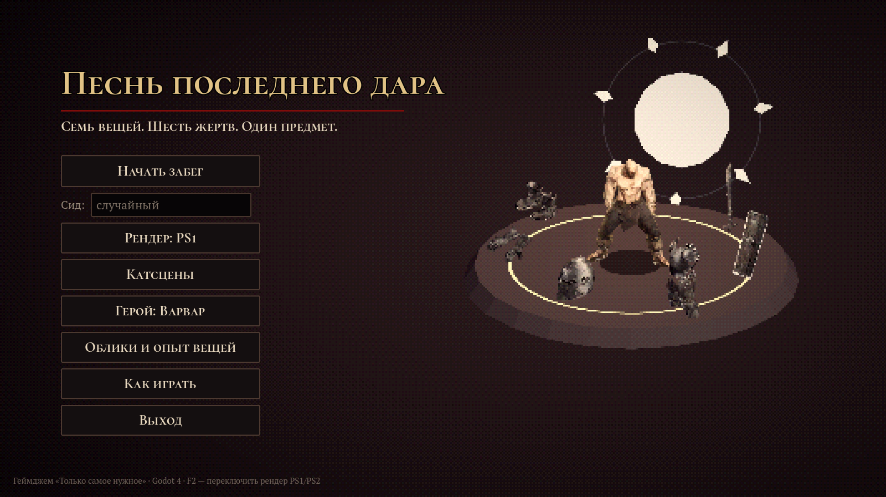
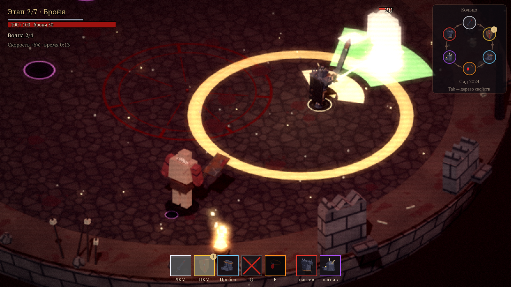
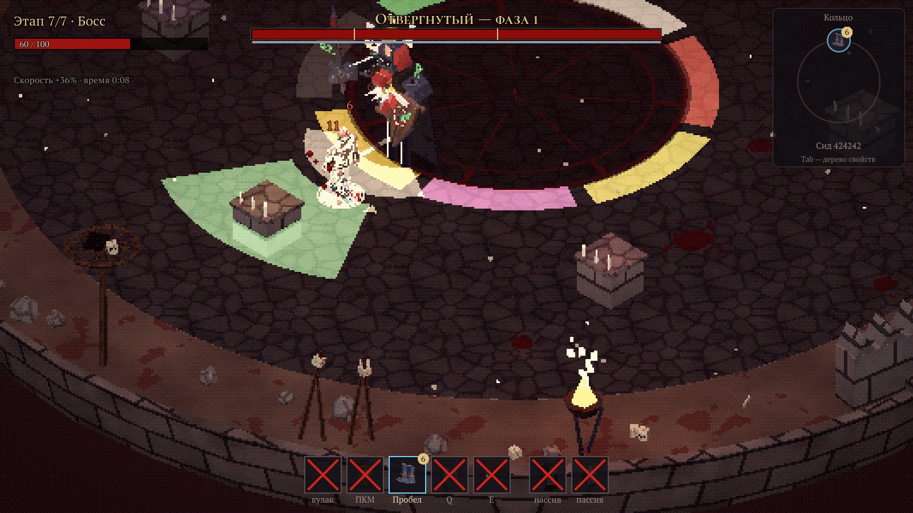

# Песнь последнего дара

**Семь вещей. Шесть жертв. Один предмет.**

Изометрическая 3D ARPG-роглайт для геймджема на тему «Только самое нужное». Godot 4.7, GDScript, гримдарк-фэнтези в ретро-стиле PS1/PS2.



## Суть

Герой начинает забег с семью вещами: меч, щит, доспех, шлем, перчатки, сапоги и амулет. Вещи стоят по кольцу в случайном по сиду порядке. После каждого из первых шести этапов герой навсегда жертвует одной вещью. Её сила уходит соседу по часовой стрелке и становится свойством «событие соседа → сила жертвы». Например, щит, ушедший в сапоги, даёт «Неуязвимый рывок». К седьмому этапу остаётся одна вещь — дерево всех решений. С ней герой выходит против Тирана, который надевает всё, что было отдано.

## Сюжет

Солдат поклялся защищать людей от Тирана — своего старшего брата Сигварда, который всю жизнь завидовал, что младший лучше во всём. Испокон веков мир знал правило: вещь, отданная добровольно, не ослабляет тебя — её сила уходит, чтобы осветить твой путь помощью ближнему. Каждая жертва на алтаре — это дар: меч раненому другу, оберег любимой, сапоги беженцу, перчатки с отцовским перстнем капитану гвардии… Все клянутся не предать — и все встают у ворот дворца рядом с Сигвардом. Кроме Ильвы, которая ничего не просила.

Сольвейг, невеста Солдата, любит его — и боится его щедрости: он раздаст всё, и они останутся в нищете, всеми брошенные. После второго дара она говорит об этом матери у очага. После третьего Сигвард зовёт её во дворец и склоняет оставить Солдата; она отказывает — но, уходя, оборачивается. У ворот она стоит рядом с Тираном.

Сюжет рассказывают сцены на движке: пролог с флешбэком на «старой плёнке», предание о правиле мира у первого алтаря, сцена дара после каждой жертвы, песня Ильвы (музыкальная сцена после второго дара), дом Сольвейг и её разговор с Сигвардом, тронный зал Сигварда между этапами, вступление у ворот дворца, реплики в бою и финал. У глав есть заставки, у кадра — виньетка и зерно; камера наезжает, облетает и «дышит». Любую сцену можно пропустить, удерживая Пробел или Esc; переключатель «Сцены в забеге» — в меню «Катсцены» и в паузе. Весь текст — в `scripts/story/story.gd`.

В главном меню есть раздел **«Катсцены»**: все сцены по порядку забега, у каждой — когда она идёт, что в ней происходит, от чего зависит и кто в ней участвует. Сцену можно посмотреть отдельно или все подряд, выбрав её вариант: какая вещь отдана, у кого оберег и перстень. В просмотре удержание Пробела пропускает сцену, удержание Esc возвращает в раздел.



## Запуск

1. Установите [Godot 4.7](https://godotengine.org/download).
2. Откройте `project.godot` и нажмите F5.

Без редактора на Windows: двойной клик по `run_game.bat`. Он обновляет импорт ресурсов (на свежем клоне ~10 с, дальше ~4 с) и запускает игру. Путь к Godot задан в начале батника (`GODOT_DIR`).

## Управление

| Клавиша | Действие |
| --- | --- |
| WASD | движение |
| Мышь | направление |
| ЛКМ | меч (без меча — кулак) |
| ПКМ (удерживать) | щит |
| Пробел | рывок сапогами |
| Q | хват перчатками |
| E | волна амулета |
| Tab | дерево свойств |
| Esc | пауза |
| ЛКМ / Пробел / Enter | в сцене — следующая реплика |
| Пробел или Esc (удерживать) | пропустить сцену |
| F2 | рендер PS1 / PS2 |
| F1 | отладочное меню |

## Забег

- 7 этапов. На этапах 1–6 идут три волны врагов и элитная волна, затем алтарь жертвы. На седьмом этапе — босс.
- 42 свойства: 7 сущностей × 6 событий других вещей. Свойства складываются в дерево на вещи-получателе.
- Каждая жертва даёт +6% скорости, каждое свойство — +10% урона вещи.
- Святилище на этапах 3 и 5 один раз меняет местами двух соседей в кольце.
- Элиты носят уже пожертвованные вещи, а босс собран из снимков всех жертв.



## Мета-прогрессия: вещи, с которыми не расстаются

Каждый убитый героем враг даёт опыт каждой вещи, надетой в момент его смерти. Опыт не делится между вещами и не зависит от того, каким навыком нанесён последний удар: учитываются кулак, свойства, волны, снаряды и отражения. Пожертвованная вещь сразу перестаёт получать XP, даже если её сущность живёт в дереве другой вещи. Обмен соседей в святилище не прерывает накопление.

Так выбор «самого нужного» становится долгосрочным: оставленная до конца вещь получает опыт на большем числе этапов, открывает новые возможности и становится ещё ценнее в следующих забегах. Жертва лишает вещи только **до конца текущего забега**; накопленный опыт и открытые облики не отнимаются.

| Враг | Базовая награда каждой вещи |
| --- | ---: |
| Рой | 2 XP |
| Пехотинец | 5 XP |
| Лучник | 6 XP |
| Заклинатель | 10 XP |
| Громила | 18 XP |
| Слизень | 8 XP |
| Слизнёныш | 2 XP |
| Шут | 8 XP |
| Тиран | 150 XP |

Награда = базовая × (1 + 0,12 × (этап − 1)), для элит дополнительно ×3; итог округляется до целого. Например, громила на первом этапе даёт 18 XP всем надетым вещам, элитный — 54 XP. Отладочное удаление врагов/пропуск этапа опыта не даёт. После смерти героя или завершения забега XP больше не начисляется.

У каждой из семи вещей **три уровня и три облика**. Уровень 1 доступен сразу, уровень 2 требует **1000 суммарного XP**, уровень 3 — **6000 суммарного XP**. Полное прохождение всех волн и босса даёт примерно 1900–2200 XP вещи, оставленной до конца: облик III рассчитан на 3–4 победных забега с одной и той же вещью. Поражения и ранние жертвы растягивают этот срок; награды врагов не снижены. Опыт между забегами суммируется и ограничен 6000; итоговая карточка отдельно показывает всю заработанную за забег награду, включая полученную после максимума. Новый уровень сразу открывает и надевает новый облик, меняя эффект родного навыка без сброса его отката. Увеличение ёмкости брони добавляет только разницу ёмкости, не восстанавливая потраченную броню.

В главном меню кнопка **«Облики и опыт вещей»** открывает постоянную коллекцию с 3D-просмотром выбранного облика, описаниями, порогами и выбором любого открытого варианта для следующего забега. Возврат к старому облику возвращает его эффект, но не уменьшает уровень. При следующем повышении уровня новый облик снова выбирается автоматически. В коллекции и разделе «Как играть» кратко объяснены начисление XP, остановка опыта после жертвы и сохранение прогресса. В бою римская цифра на слоте обозначает надетый облик, золотая полоска — суммарный XP относительно следующего порога. Открытие сопровождается сообщением.

**Tab — кольцо навыков.** Бой приостанавливается; все семь вещей и поглощённых сил видны в одной круговой диаграмме. Сектора подписаны названиями вещей: «Доспех», «Щит», «Меч» и т. д. Надетые вещи сохраняют свой цвет, пожертвованные становятся серыми. Внутренняя дуга объединяет навык с его силами и показывает кнопку запуска. Навыки идут в текущем порядке кольца, с учётом обменов в святилище; внутри каждого навыка цифры обозначают порядок срабатывания по часовой стрелке. Шаг 1 — родной навык. Наведение показывает одну подсказку у курсора: кнопку, облик и XP надетой вещи либо носителя и остановленный опыт поглощённой силы. Постоянных карточек вокруг кольца нет. Выбор сектора оставляет всё кольцо на экране и открывает короткие боевые параметры справа; путь к выбранной силе подсвечивается без стрелок. У надетой вещи перечислены полученные от слияний эффекты: значок, номер в кольце и одна короткая строка. У поглощённой вещи показаны название и описание её нового навыка. Параметры учитывают надетый облик и бонус урона носителя; улучшения облика жертвы не приписываются её сущности. Tab, Esc или «В бой» закрывают схему. Кольцо убрано из боевого HUD; на алтаре и в святилище оно остаётся для выбора жертв и обмена.

После забега крупный заголовок **«Победа» / «Поражение»** стоит сверху по центру. Опыт показан **колесом из семи секторов**, в каждом три равных пояса I–III, как в коллекции обликов. I заполнен изначально; II показывает интервал 0–1000 XP, III — 1000–6000 XP. Уже накопленный опыт тусклый, прибавка за забег яркая и появляется с анимацией; новые облики отмечены золотой точкой. В центре — число открытых обликов из 21. Наведение на сектор, значок или название показывает одну подсказку с полной наградой +XP и суммарным опытом. На максимуме все три пояса полные; полученную награду отмечает яркий внешний край, её число остаётся в подсказке и карточке. Нажатие на значок выбирает вещь, на пояс — её облик. Справа кнопки I–III переключают 3D-просмотр и описание прямо на итоговом экране, включая закрытые варианты. Открытый облик можно выбрать для следующего забега; просмотр сам по себе выбор не меняет. Отдельная кнопка «Все облики» убрана. «Путь забега» открывает дерево свойств и историю жертв.

Коллекция в главном меню также показана кругом без прокрутки: в каждом из семи секторов три кольца обликов I–III, во внешней части — значок и название вещи, как в боевом Tab. Карточек вокруг кольца нет; наведение на любой сектор показывает одну подсказку с суммарным опытом, числом открытых обликов и XP до следующего уровня. Открытые облики цветные, закрытые тёмные, выбранный отмечен золотой точкой. Нажатие на значок выбирает вещь, на кольцо или одну из трёх 3D-карточек — конкретный облик, включая ещё закрытый. Для открытого варианта доступна кнопка выбора на следующий забег; справа показан только его эффект.

3D-превью коллекции, итоговый артефакт и значки колёс используют вещи выбранного героя: варвара, тамплиера, космодесанта или рыцаря. Украшения обликов II–III и добавки поглощённых сил накладываются на поверхность новых моделей. Смена героя или выбранного облика обновляет значки; прибавка XP без смены облика не требует повторного рендера. В сюжетных сценах надетые вещи сохраняют облики текущего забега, а подарки, оберег у очага и вещи в финале — облики снимков жертв. Галерея катсцен показывает героя с выбранными в мета-прогрессии обликами.

| Вещь | Уровень 1 — исходный облик | Уровень 2 — пробуждение | Уровень 3 — реликвия |
| --- | --- | --- | --- |
| Меч | Комбо 10/10/20, сектор 120° | **Клинок клятвы:** завершающий удар охватывает 240° | **Клинок последнего света:** завершающий удар охватывает 360° на 3,2 м |
| Щит | Блок спереди на 120° | **Щит стража:** поднятие отражает снаряды 0,35 с | **Эгида семи:** отражение 0,7 с, блок 180° |
| Доспех | 50 брони, восстановление после волны | **Кираса возмездия:** полученный удар отталкивает врагов в радиусе 2 м на 1,5 м; откат ответа 1 с | **Панцирь титана:** 70 брони; ответ в радиусе 3 м толкает на 2 м и оглушает на 0,5 с; откат 1 с |
| Шлем | Окно крита 0,8 с после атаки врага | **Венец прозрения:** крит родным действием открывает цель ещё на 1,2 с | **Корона всевидящего:** открывает цель и врагов в радиусе 3 м от неё на 1,8 с |
| Перчатки | Хват 60°, 6 м, оглушение 0,8 с | **Оковы охотника:** захваченные цели открываются для крита на 1 с, включая удар самого хвата | **Длань властелина:** сектор хвата 100°, открытие на 2 с |
| Сапоги | Рывок 4 м за 0,18 с | **Шаг сквозь пепел:** первые 0,1 с рывка неуязвимы | **Крылья исхода:** рывок 5 м, неуязвимость на все 0,18 с |
| Амулет | Волна 20 урона на 8 м, толчок 1 м | **Печать изгнания:** волна отбрасывает на 2 м | **Сердце рассвета:** толчок 3 м и оглушение 0,6 с |

Все неуказанные параметры остаются исходными. Новые эффекты не добавляют событий в дерево свойств; ответ доспеха и открытие целей шлемом сами не наносят урон. Иммунитет громил к перемещению действует и на улучшенные навыки.

Облики используют существующий лоу-поли стиль: гранёный металл, раскалённые красные кромки и пиксельное красное пламя. Шлем II получает один центральный рог, III — два изогнутых боковых; щит — один и два рога соответственно. У доспеха II шип на одном плече, III — по два на обоих. На носках сапог II по одному шипу, III — по два. Перчатки II имеют шипы только на фалангах, III добавляют рога на запястьях. Меч II получает красную руну с обеих сторон клинка, III — парные кромки и горящие рога гарды; амулет — красную печать с тремя или семью лучами. На III пламя подчёркивает рога. Исходный облик I сохраняет модель героя. Геометрия строится по поверхности каждой вещи и следует её костям в анимациях; в витринах используются те же детали. Украшения видны на герое, в витрине, на постаментах и на противниках, отдельно от добавок поглощённых сущностей. Снимок жертвы фиксирует текущий облик; элита и босс используют его эффект через те же компоненты. Уровень жертвы и её особый навык не переходят к соседу: передаётся прежнее дерево свойств.

Прогресс автоматически записывается после каждой награды и выбора облика, независимо от победы или поражения. При каждом экспорте включённый плагин **Build profile** добавляет в билд случайный `build_profile.id`; опыт и выбор обликов хранятся отдельно в **`user://builds/<id>/item_mastery.cfg`**. Новая сборка начинает с нуля, повторный запуск и копирование той же сборки сохраняют её профиль. Windows и Web используют один механизм. В редакторе остаётся прежний **`user://item_mastery.cfg`**; его опыт не переносится в экспорт. Если редактор был открыт до добавления плагина, его нужно один раз перезапустить перед экспортом. Билд без корректного идентификатора отключает сохранение XP и сообщает об ошибке, чтобы не загрузить общий профиль. Запись использует временный файл и резервную копию `.bak`; при нечитаемом основном файле загружается резервная копия. Это локальный профиль: перезапуск игры сохраняет коллекцию, удаление пользовательских данных её удаляет. В отладке (F1) кнопка **«Сбросить мета-прогресс»** после подтверждения обнуляет опыт, награды забега и выбор обликов; основной файл и резервная копия записываются с пустым прогрессом. В текущем бою надетые вещи возвращаются к облику I, сохраняя свойства и откаты; здоровье и потраченная броня не восстанавливаются. Снимки совершённых жертв и артефакт завершённого забега сохраняют исторический облик. Ошибка записи отмечается в отладке, коллекции и итоговой карточке. Числа, названия и эффекты находятся в `data/item_mastery.json`; файл включён в Windows/Web-экспорт.

## Устройство

- `data/` — все числа в ресурсах `.tres`: `ItemDef`, `EssenceDef`, баланс, враги, угрозы.
- `scripts/core/` — кольцо, свойства, шина событий.
- `scripts/combat/`, `scripts/actions/`, `scripts/effects/` — персонажи, компоненты-действия, эффекты сущностей.
- `scripts/control/` — `PlayerController` и `AIController`.
- `scripts/game/`, `scripts/visual/`, `scripts/ui/` — режиссёр забега, модели, интерфейс.
- `scripts/story/`, `scripts/cutscene/` — сюжет и сцены: режиссёр сцен, марионетки, кинорамка и субтитры, эффекты и декорации сцен, каталог сцен и их просмотр из меню.
- `shaders/` — ретро-материал и экранная постобработка PS1/PS2.

Решения по толкованию ТЗ и устройство подробно описаны в [docs/DESIGN.md](docs/DESIGN.md).

## Тесты и инструменты

```bash
# GUT: все 42 свойства, цепочка из примера, кольцо, мета-прогрессия, сюжет, сцены и их каталог
godot --headless --path . -s addons/gut/gut_cmdln.gd

# Все сюжетные сцены подряд без игрока: сколько длится каждая и все ли доходят до конца
# (key=hearth — одна сцена; ключи — в scripts/story/cutscene_catalog.gd)
godot --headless --path . -s tools/theater.gd -- speed=8
# Карта ряби сцены на её 55-й секунде: где поверхности мигают, перекрывая друг друга (нужен экран)
godot --audio-driver Dummy --path . -s tools/flicker.gd -- key=song at=55 out=/tmp/flicker.png

# Бот проходит забег целиком и печатает время и урон по этапам (cutscenes=1 — вместе со сценами)
godot --headless --path . -s tools/autoplay.gd -- seed=1234 speed=8 immortal=1 --meta-memory

# Все тексты сюжета с метками — в JSON, из него — таблица реплик docs/Сюжет_диалоги.xlsx
# (третий аргумент — прежняя таблица: изменённые реплики получат колонку «Было раньше»)
godot --headless --path . -s tools/export_story.gd -- out=story.json
python3 tools/story_table.py story.json docs/Сюжет_диалоги.xlsx

# Кадр сцены: preset = prologue | gift | gates | finale (и прежние game | altar | boss | gallery …)
godot --path . -s tools/shot.gd -- preset=gates out=/tmp/gates.png delay=20
# Раскадровка: кадр каждые 3 секунды до delay — gates_003.png, gates_006.png …
godot --path . -s tools/shot.gd -- preset=gates out=/tmp/gates.png delay=120 every=3
# Любая сцена из меню «Катсцены» по ключу (speed ускоряет время); preset=cutscenes — само меню
godot --path . -s tools/shot.gd -- preset=theater key=hearth out=/tmp/hearth.png delay=80 every=5 speed=3

# Пересобрать звук, музыку и текстуры
python3 tools/gen_audio.py
python3 tools/gen_textures.py
```

Для изоляции игрового профиля в тестах задайте переменную окружения `GODOT_META_MEMORY=1` (PowerShell: `$env:GODOT_META_MEMORY = "1"`). Она отключает чтение и запись профиля; тест сохранения использует отдельный файл в `.godot/`. Для бота и скриншотов также доступен аргумент `--meta-memory` после `--`.

## Ассеты и лицензии

- Модели, текстуры, звук и музыка сгенерированы процедурно скриптами из `tools/` и кодом игры.
- Шрифты [Cormorant SC](https://github.com/CatharsisFonts/Cormorant) и [PT Serif](https://www.paratype.ru/) распространяются по SIL Open Font License, лицензии лежат в `assets/fonts/`.
- [GUT](https://github.com/bitwes/Gut) распространяется по MIT License, лицензия лежит в `addons/gut/`.
